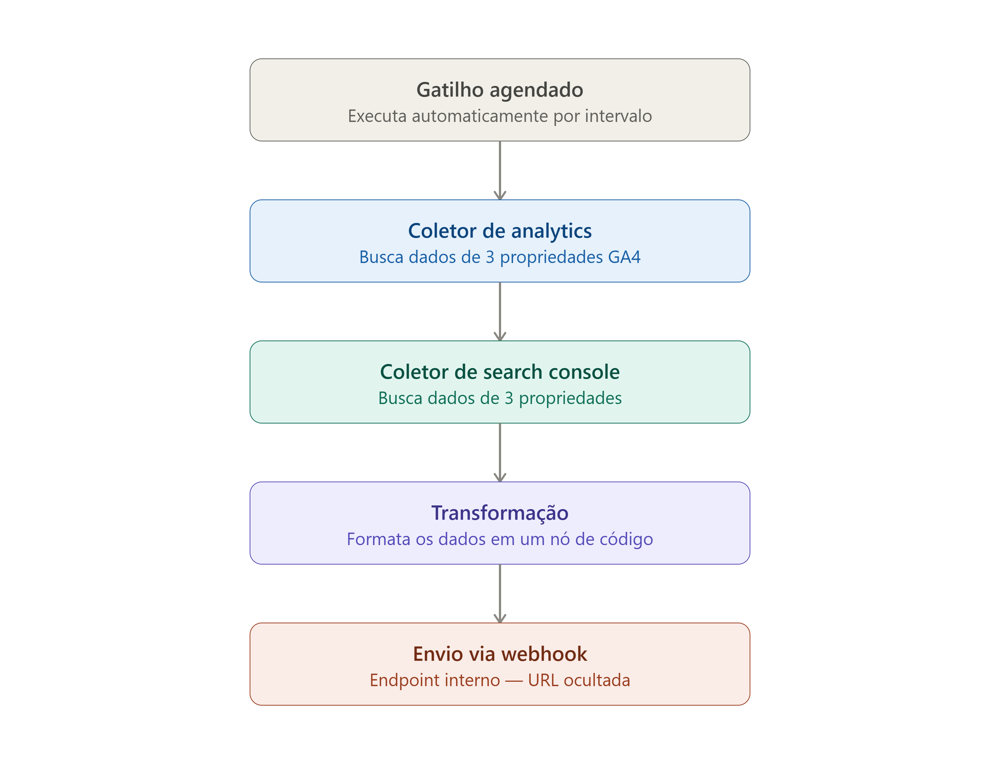

# 📊 Multi-Site Growth & SEO Intelligence Pipeline (n8n + GA4 + Search Console + Slack)



Pipeline automatizado de inteligência de produto e aquisição desenvolvido no **n8n**. O fluxo orquestra semanalmente a extração de dados de tráfego, qualidade de sessões e termos de busca orgânica via **Google Analytics Data API (GA4)** e **Google Search Console API**, normaliza os dados via JavaScript e entrega um reporte consolidado diretamente no **Slack**.

---

## 🎯 Contexto e Objetivo de Produto

Gerenciar múltiplos produtos digitais e domínios exige monitoramento contínuo de aquisição sem sobrecarregar a rotina operacional. Relatórios isolados ou painéis complexos geram fricção e dificultam tomadas de decisão rápidas de SEO e distribuição.

Este pipeline resolve:
- **Centralização Multi-Propriedade:** Consolida em um único disparo as métricas de diferentes SaaS e domínios institucionais.
- **Tráfego + Intenção de Busca:** Combina volume/engajamento por canal (GA4) com as principais palavras-chave orgânicas rankeadas (Search Console).
- **Consumo Prático:** Entrega semanal direta no Slack para acompanhamento ágil do time e alinhamento de roadmap/crescimento.

---

## 🏗️ Arquitetura do Pipeline

```text
[Schedule Trigger] (Segunda-feira, 08:00)
       │
       ▼
[GA4 - Produto 1] ──► [GA4 - Produto 2] ──► [GA4 - Produto 3]
                                                   │
                                                   ▼
[GSC - Produto 1] ◄── [GSC - Produto 2] ◄── [GSC - Produto 3]
       │
       ▼
[Code Node (JavaScript)] ──► Formata métricas e monta layout Markdown
       │
       ▼
[HTTP Request - Slack]  ──► Disparo via Incoming Webhook para canal privado
